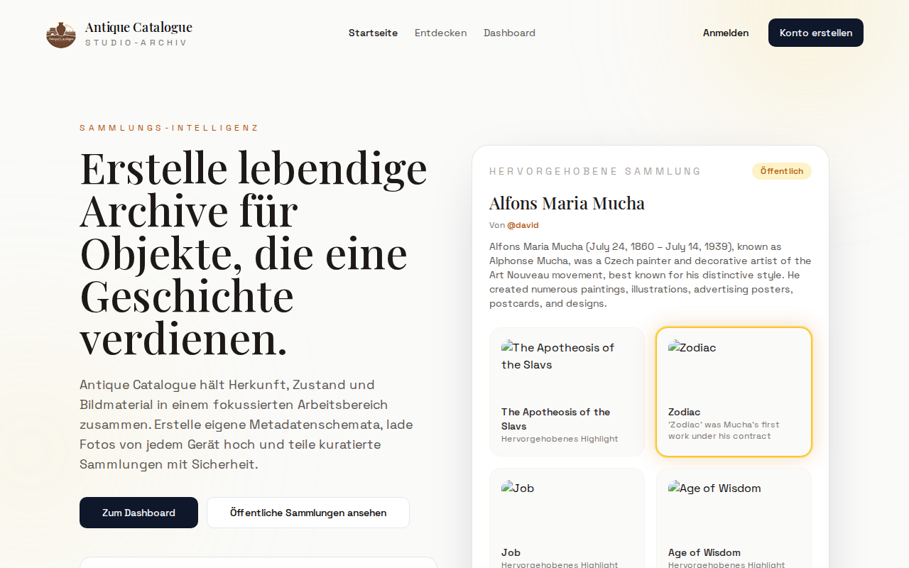

# Antique Catalogue

A responsive web platform for cataloguing antique items with custom metadata schemas, image management, and public collection sharing.

<!-- Add a screenshot: place it at docs/screenshot.png and uncomment below -->
<!--  -->

## Features

### Core
- **Custom Metadata Schemas** — Define per-collection fields (text, number, date, select, checkbox, timestamp) with validation, ordering, and privacy controls
- **Image Management** — Upload, resize (original/medium/thumb), and reorder item photos with drag support
- **Camera Capture** — Take photos directly from your browser on mobile devices
- **Public Collections** — Share curated collections publicly while keeping others private
- **User Authentication** — Email verification, password reset, JWT-based sessions with refresh tokens
- **Search & Filter** — Full-text search with metadata filtering and multi-field sorting
- **Stars** — Star collections and items; leaderboard ranking by earned stars
- **Activity Log** — Track item/collection creation, updates, and deletions
- **Schema Templates** — Create reusable metadata schemas, copy between collections

### Speed Capture ⚡
A mobile-optimized capture-first workflow for fast cataloguing:
- Full-screen camera interface — no distractions, buttons always visible
- Two-tap flow: **New Item** creates a draft, **Same Item** adds another photo
- Live stats counter (items + photos captured)
- Existing drafts shown as scrollable thumbnails when re-entering a collection
- Drafts auto-graduate to regular items when you add a name or metadata
- Draft toggle on collection pages with count indicator

### Profiles & Public Pages
- **User Profiles** — Custom username, avatar upload (with auto-generated variants)
- **Public Profile Pages** — `/profile/{username}` showing public collections and star stats
- **Featured Collections** — Admin-curated featured collection on the homepage

### Admin Panel
- User management (list, search, activate/deactivate)
- Collection management (featured collection, public/private toggle)
- Item management with bulk operations
- Stats dashboard (total users, collections, featured status)

### Internationalization
- English and German (auto-detected from browser, switchable in settings)

## Architecture

```
┌─────────────────┐     ┌─────────────────┐
│                 │     │                 │
│  Next.js        │────▶│  FastAPI        │
│  Frontend       │     │  Backend        │
│  (Port 3000)    │     │  (Port 8000)    │
│                 │     │                 │
└─────────────────┘     └────────┬────────┘
                                 │
                        ┌────────▼────────┐
                        │                 │
                        │  SQLite DB      │
                        │  + File Storage │
                        │                 │
                        └─────────────────┘
```

## Tech Stack

### Backend
- **FastAPI** — Modern Python web framework
- **SQLAlchemy** — ORM with type-annotated models
- **Alembic** — Database migrations (14 migrations)
- **Pillow** — Image processing (resize, EXIF transpose, JPEG optimization)
- **SQLite** — Database (easily swappable to PostgreSQL)
- **Pydantic v2** — Request/response validation

### Frontend
- **Next.js 14** — React framework with App Router
- **Tailwind CSS** — Utility-first styling
- **Lucide React** — Icon library
- **TypeScript** — Full type safety across the frontend

## Quick Start

### Prerequisites
- Docker & Docker Compose
- (Optional) Node.js 20+ and Python 3.12+ for local development

### Production Deployment

1. Clone the repository:
   ```bash
   git clone https://github.com/Endogen/antique-catalogue.git
   cd antique-catalogue
   ```

2. Configure environment (optional):
   ```bash
   cat > .env << 'EOF'
   JWT_SECRET=your-secure-random-secret
   SMTP_HOST=mail.example.com
   SMTP_PORT=587
   SMTP_USER=noreply@example.com
   SMTP_PASSWORD=your-smtp-password
   SMTP_FROM=noreply@example.com
   EOF
   ```

3. Start with Docker Compose:
   ```bash
   docker compose up -d
   ```

4. Access the application:
   - Frontend: `http://localhost:3010`
   - Backend API: `http://localhost:8000`
   - Health check: `http://localhost:8000/health`

### Nginx Reverse Proxy

```nginx
server {
    listen 80;
    server_name antique.example.com;

    location / {
        proxy_pass http://127.0.0.1:3010;
        proxy_http_version 1.1;
        proxy_set_header Upgrade $http_upgrade;
        proxy_set_header Connection 'upgrade';
        proxy_set_header Host $host;
        proxy_set_header X-Real-IP $remote_addr;
        proxy_set_header X-Forwarded-For $proxy_add_x_forwarded_for;
        proxy_set_header X-Forwarded-Proto $scheme;
    }

    location /api/ {
        proxy_pass http://127.0.0.1:8000/;
        proxy_http_version 1.1;
        proxy_set_header Host $host;
        proxy_set_header X-Real-IP $remote_addr;
        proxy_set_header X-Forwarded-For $proxy_add_x_forwarded_for;
        proxy_set_header X-Forwarded-Proto $scheme;
        client_max_body_size 50M;
    }
}
```

Then enable SSL:
```bash
sudo certbot --nginx -d antique.example.com
```

## Local Development

### Backend

```bash
cd backend
python3.12 -m venv .venv
source .venv/bin/activate
pip install -e ".[dev]"
alembic upgrade head
uvicorn app.main:app --reload --port 8000
```

### Frontend

```bash
cd frontend
npm install
export NEXT_PUBLIC_API_URL=http://localhost:8000
npm run dev
```

## API Endpoints

### Authentication
| Method | Path | Description |
|--------|------|-------------|
| POST | `/auth/register` | Create account |
| POST | `/auth/verify` | Verify email |
| POST | `/auth/login` | Get access token |
| POST | `/auth/refresh` | Refresh token |
| POST | `/auth/forgot-password` | Request password reset |
| POST | `/auth/reset-password` | Reset password |
| GET | `/auth/me` | Get current user |
| DELETE | `/auth/me` | Delete account |

### Collections
| Method | Path | Description |
|--------|------|-------------|
| GET | `/collections` | List user's collections |
| POST | `/collections` | Create collection |
| GET | `/collections/{id}` | Get collection |
| PATCH | `/collections/{id}` | Update collection |
| DELETE | `/collections/{id}` | Delete collection |
| GET | `/public/collections` | List public collections |
| GET | `/public/collections/featured` | Get featured collection |

### Items
| Method | Path | Description |
|--------|------|-------------|
| GET | `/collections/{id}/items` | List items (search/filter/sort, `?include_drafts=true`) |
| POST | `/collections/{id}/items` | Create item |
| GET | `/collections/{id}/items/{item_id}` | Get item |
| PATCH | `/collections/{id}/items/{item_id}` | Update item (clears draft flag) |
| DELETE | `/collections/{id}/items/{item_id}` | Delete item |

### Speed Capture
| Method | Path | Description |
|--------|------|-------------|
| POST | `/speed-capture/{collection_id}/new` | Create draft item + upload first photo |
| POST | `/speed-capture/{collection_id}/items/{item_id}/add` | Add photo to existing draft |
| GET | `/speed-capture/{collection_id}/session` | Get capture session stats |

### Images
| Method | Path | Description |
|--------|------|-------------|
| POST | `/items/{item_id}/images` | Upload image |
| GET | `/items/{item_id}/images` | List images |
| PATCH | `/items/{item_id}/images/{image_id}` | Reorder image |
| DELETE | `/items/{item_id}/images/{image_id}` | Delete image |
| GET | `/images/{image_id}/{variant}.jpg` | Serve image (`?token=` for private) |

### Profiles
| Method | Path | Description |
|--------|------|-------------|
| GET | `/profiles/me` | Get own profile |
| PATCH | `/profiles/me` | Update username |
| POST | `/profiles/me/avatar` | Upload avatar |
| DELETE | `/profiles/me/avatar` | Delete avatar |
| GET | `/profiles/{username}` | Get public profile |
| GET | `/avatars/{user_id}/{variant}.jpg` | Serve avatar |

### Stars
| Method | Path | Description |
|--------|------|-------------|
| GET | `/stars/collections` | List starred collections |
| GET | `/stars/items` | List starred items |
| POST | `/stars/collections/{id}` | Star collection |
| DELETE | `/stars/collections/{id}` | Unstar collection |
| POST | `/stars/collections/{id}/items/{item_id}` | Star item |
| DELETE | `/stars/collections/{id}/items/{item_id}` | Unstar item |

### Schema & Templates
| Method | Path | Description |
|--------|------|-------------|
| GET | `/collections/{id}/fields` | List fields |
| POST | `/collections/{id}/fields` | Create field |
| PATCH | `/collections/{id}/fields/{field_id}` | Update field |
| DELETE | `/collections/{id}/fields/{field_id}` | Delete field |
| PATCH | `/collections/{id}/fields/reorder` | Reorder fields |
| GET | `/schema-templates` | List templates |
| POST | `/schema-templates` | Create template |
| POST | `/schema-templates/{id}/copy` | Copy template |

### Other
| Method | Path | Description |
|--------|------|-------------|
| GET | `/activity` | Activity log |
| GET | `/search/items` | Global item search |
| GET | `/health` | Health check |

## Environment Variables

| Variable | Default | Description |
|----------|---------|-------------|
| `DATABASE_URL` | auto-detected SQLite | Database connection string |
| `UPLOADS_PATH` | `./uploads` | Path for uploaded images |
| `JWT_SECRET` | `change-me` | Secret for JWT signing (**change in production**) |
| `JWT_ALGORITHM` | `HS256` | JWT algorithm |
| `JWT_ACCESS_TOKEN_EXPIRE_MINUTES` | `30` | Access token expiry |
| `AUTO_VERIFY_EMAIL` | `false` | Auto-verify on registration (dev only) |
| `REFRESH_TOKEN_COOKIE_PATH` | `/` | Refresh token cookie scope |
| `ADMIN_EMAIL` | — | Admin login email |
| `ADMIN_PASSWORD` | — | Admin login password |
| `ADMIN_TOKEN_EXPIRE_MINUTES` | `60` | Admin token expiry |
| `SMTP_HOST` | — | SMTP server hostname |
| `SMTP_PORT` | `587` | SMTP server port |
| `SMTP_USER` | — | SMTP username |
| `SMTP_PASSWORD` | — | SMTP password |
| `SMTP_FROM` | — | From address for emails |
| `SMTP_USE_TLS` | `true` | Use STARTTLS |

## Testing

```bash
cd backend
source .venv/bin/activate

# Run all tests
pytest

# Run with coverage
pytest --cov=app --cov-report=term-missing

# Run specific test file
pytest tests/test_items.py -v
```

## Project Structure

```
antique-catalogue/
├── backend/
│   ├── app/
│   │   ├── api/           # Route handlers (auth, items, images, speed_capture, ...)
│   │   ├── core/          # Settings, security, exceptions
│   │   ├── db/            # Database setup
│   │   ├── models/        # SQLAlchemy models
│   │   ├── schemas/       # Pydantic schemas
│   │   └── services/      # Business logic (image processing, metadata, activity)
│   ├── alembic/           # Database migrations
│   ├── tests/             # Backend tests
│   ├── Dockerfile
│   └── pyproject.toml
├── frontend/
│   ├── app/
│   │   ├── (app)/         # Authenticated pages (dashboard, collections, speed-capture, ...)
│   │   ├── (auth)/        # Auth pages (login, register, verify, ...)
│   │   ├── explore/       # Public collection browser
│   │   └── profile/       # Public profile pages
│   ├── components/        # React components (app-shell, image-gallery, lightbox, ...)
│   ├── lib/               # API client, i18n, utilities
│   ├── Dockerfile
│   └── package.json
├── docker-compose.yml
└── README.md
```

## License

MIT

## Credits

Built with [Codex](https://github.com/openai/codex) and [Claude](https://claude.ai) using the [Ralph Loop](https://github.com/Endogen/ralph-loop) pattern.
