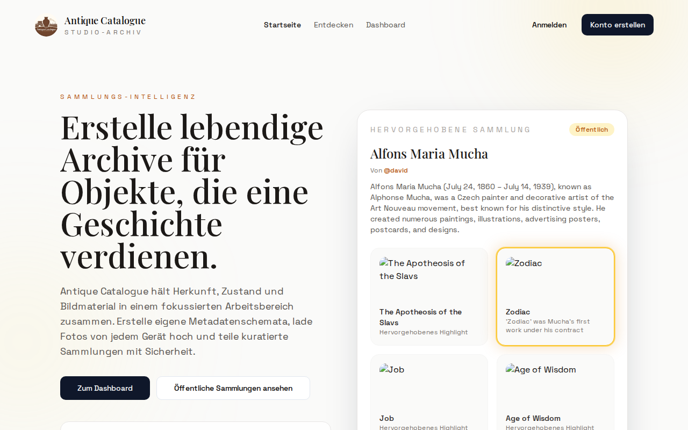
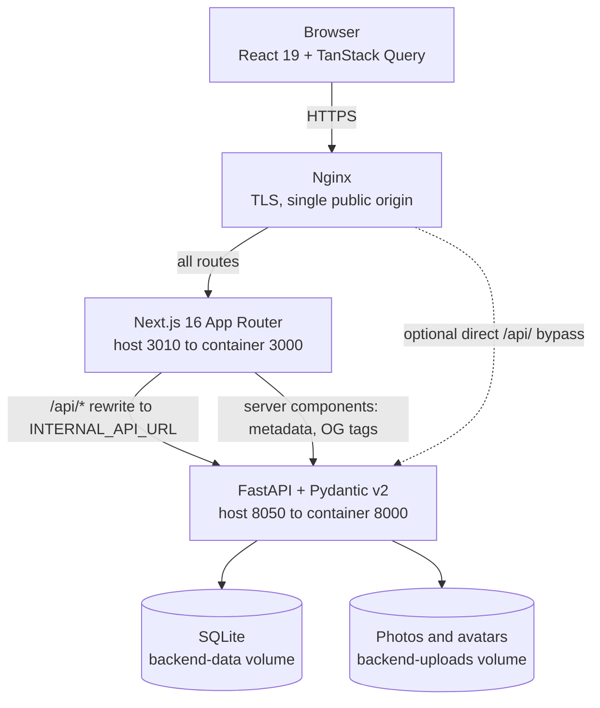

# Antique Catalogue

A responsive web platform for cataloguing antique items with custom metadata schemas, image management, and public collection sharing.



## Features

### Core
- **Custom Metadata Schemas** — Define per-collection fields (text, number, date, select, checkbox, timestamp) with validation, ordering, and privacy controls
- **Backup & Restore** — Export complete owner ZIP backups and restore new private collections with validation
- **Resumable Uploads** — Persistent photo queue with chunk recovery, retries, and duplicate prevention
- **Image Management** — Upload, resize (original/large/medium/thumb), and drag-to-reorder item photos; full-screen lightbox viewer served the `large` variant rather than the full-size original
- **Camera Capture** — Take photos directly from your browser on mobile devices; photos are downscaled in the browser first, so uploads are quick and full-resolution shots are never rejected for size
- **Public Collections** — Share curated collections publicly while keeping others private
- **User Authentication** — Email verification, password reset, JWT-based sessions with refresh tokens
- **Search & Filter** — Text search with metadata filtering and one selected sort field/direction
- **Stars** — Star collections and items; leaderboard ranking by earned stars
- **Activity Log** — Track item/collection creation, updates, and deletions
- **Schema Templates** — Create reusable metadata schemas, copy between collections
- **Dashboard** — Personal overview with collections summary and recent activity feed
- **Light & Dark Theme** — Follows the system setting by default with an in-app toggle; applied before first paint, so there is no flash on load

### Speed Capture ⚡
A mobile-optimized capture-first workflow for fast cataloguing:
- Full-screen camera interface — no distractions, buttons always visible
- Two-tap flow: **New Item** creates a draft, **Same Item** adds another photo
- Live stats counter (items + photos captured)
- Shooting never waits on the network: photos appear immediately and upload in the background, in order, through the resumable queue
- Existing drafts shown as scrollable thumbnails when re-entering a collection
- Drafts remain private, including their photos; saving a name or metadata publishes them only after required fields validate
- Draft-only pagination keeps older captures accessible
- Draft toggle on collection pages with count indicator

### Profiles & Public Pages
- **User Profiles** — Custom username, avatar upload (with auto-generated variants)
- **Public Profile Pages** — `/profile/{username}` showing public collections and star stats
- **Account Settings** — Language and appearance preferences, password reset, and account deletion
- **Featured Collections** — Admin-curated featured collection on the homepage
- **Spotlight Items** — Mark specific items as spotlights within the featured collection to highlight them on the homepage

### Admin Panel
- User management (list, search, lock/unlock accounts, delete)
- Collection management (featured collection selection, delete)
- Item management (list, search, delete) with spotlight selection for featured items
- Stats dashboard (total users, collections, items, featured status)

### Internationalization
- English and German, switchable in settings
- The locale is resolved on the server from a saved cookie, falling back to `Accept-Language`, so the first response already carries the right copy and a matching `<html lang>` for crawlers

## Architecture


```mermaid
flowchart TD
    browser["Browser<br/>React 19 + TanStack Query"]
    nginx["Nginx<br/>TLS, single public origin"]
    frontend["Next.js 16 App Router<br/>host 3010 to container 3000"]
    backend["FastAPI + Pydantic v2<br/>host 8050 to container 8000"]
    db[("SQLite<br/>backend-data volume")]
    files[("Photos and avatars<br/>backend-uploads volume")]

    browser -->|HTTPS| nginx
    nginx -->|"all routes"| frontend
    frontend -->|"/api/* rewrite to INTERNAL_API_URL"| backend
    frontend -->|"server components: metadata, OG tags"| backend
    nginx -.->|"optional direct /api/ bypass"| backend
    backend --> db
    backend --> files
```

The browser only ever talks to the frontend origin: Next.js rewrites `/api/*` to
the backend, so authentication cookies stay same-origin. Server components reach
the backend directly over `INTERNAL_API_URL` to render public metadata. Only the
two host ports above are published, and both bind to loopback.

## Tech Stack

### Backend
- **FastAPI** — Modern Python web framework
- **SQLAlchemy** — ORM with type-annotated models
- **Alembic** — Database migrations (17 migrations)
- **Pillow** — Image processing (resize, EXIF transpose, JPEG optimization)
- **SQLite** — Database (easily swappable to PostgreSQL)
- **Pydantic v2** — Request/response validation

### Frontend
- **Next.js 16 / React 19** — React framework with App Router
- **TanStack Query** — Server-state cache; cancels superseded reads, deduplicates
  identical ones, and refreshes affected views after every write
- **Tailwind CSS** — Utility-first styling over semantic design tokens that drive
  both themes from one palette definition
- **React Hook Form + Zod** — Form state and schema validation
- **Lucide React** — Icon library
- **TypeScript** — Full type safety across the frontend

## Quick Start

### Prerequisites
- Docker & Docker Compose
- (Optional) Node.js 22.12+ and Python 3.12+ for local development

### Production Deployment

1. Clone the repository:
   ```bash
   git clone https://github.com/Endogen/antique-catalogue.git
   cd antique-catalogue
   ```

2. Configure environment (`JWT_SECRET` is required):
   ```bash
   cat > .env << 'EOF'
   JWT_SECRET=your-secure-random-secret  # e.g. openssl rand -hex 32
   SMTP_HOST=mail.example.com
   SMTP_PORT=587
   SMTP_USER=noreply@example.com
   SMTP_PASSWORD=your-smtp-password
   SMTP_FROM=noreply@example.com
   PUBLIC_APP_URL=https://antique.example.com
   REFRESH_TOKEN_COOKIE_SECURE=true
   EOF
   ```

3. Start with Docker Compose:
   ```bash
   docker compose up -d
   ```

4. Access the application:
   - Frontend: `http://localhost:3010`
   - Backend API: `http://localhost:8050`
   - Health check: `http://localhost:8050/health`

### Nginx Reverse Proxy

When using Docker Compose, the Next.js frontend already proxies `/api/*` requests to the backend internally — so only the `location /` block is strictly required. The optional `/api/` block below routes API traffic directly to the backend, bypassing Next.js, which can be useful for performance or if you run the backend standalone.

```nginx
server {
    listen 80;
    server_name antique.example.com;

    location / {
        client_max_body_size 260M;
        proxy_read_timeout 300s;
        proxy_pass http://127.0.0.1:3010;
        proxy_http_version 1.1;
        proxy_set_header Upgrade $http_upgrade;
        proxy_set_header Connection 'upgrade';
        proxy_set_header Host $host;
        proxy_set_header X-Real-IP $remote_addr;
        proxy_set_header X-Forwarded-For $proxy_add_x_forwarded_for;
        proxy_set_header X-Forwarded-Proto $scheme;
    }

    # Optional: route API calls directly to the backend
    location /api/ {
        proxy_pass http://127.0.0.1:8050/;
        proxy_http_version 1.1;
        proxy_set_header Host $host;
        proxy_set_header X-Real-IP $remote_addr;
        proxy_set_header X-Forwarded-For $proxy_add_x_forwarded_for;
        proxy_set_header X-Forwarded-Proto $scheme;
        client_max_body_size 260M;
        proxy_read_timeout 300s;
    }
}
```

Then enable SSL:
```bash
sudo certbot --nginx -d antique.example.com
```

## Local Development

### Backend

```bash
cd backend
python3.12 -m venv .venv
source .venv/bin/activate
pip install -e ".[dev]"
alembic upgrade head
uvicorn app.main:app --reload --port 8000
```

### Frontend

```bash
cd frontend
npm install
export INTERNAL_API_URL=http://localhost:8000
npm run dev
```

Keep the default client API URL (`/api`) so authentication cookies use the same origin.
Configure SMTP and `PUBLIC_APP_URL` for verification/reset links, or set
`AUTO_VERIFY_EMAIL=true` for local development. Failed registration delivery rolls
back the account and returns a retryable error. The verification page can resend
mail for an existing account. Password-reset requests keep a generic response to
avoid revealing account existence; failed delivery rolls back the reset token.

### Updating an existing installation

Run `alembic upgrade head` before starting the updated backend (the Docker Compose
startup command does this automatically). Migration 0016 preserves historical metadata
without matching schema fields in an owner-only archive and adds revocable sessions.
Existing sessions must sign in again after this update. Password reset revokes all
sessions and outstanding recovery links; logout revokes the current session and
refresh cookies rotate on use. Set `PUBLIC_APP_URL` to the externally reachable app
origin so emailed links open the correct site.

## API Endpoints

### Authentication
| Method | Path | Description |
|--------|------|-------------|
| POST | `/auth/register` | Create account |
| POST | `/auth/verify` | Verify email |
| POST | `/auth/resend-verification` | Resend verification for an unverified account (rate limited) |
| POST | `/auth/login` | Get access token |
| POST | `/auth/refresh` | Refresh token |
| POST | `/auth/logout` | Revoke current session and clear refresh cookie |
| POST | `/auth/forgot` | Request password reset |
| POST | `/auth/reset` | Reset password and revoke all sessions |
| GET | `/auth/me` | Get current user |
| DELETE | `/auth/me` | Delete account |

### Collections
| Method | Path | Description |
|--------|------|-------------|
| GET | `/collections` | List user's collections |
| POST | `/collections` | Create collection |
| GET | `/collections/{id}` | Get collection |
| PATCH | `/collections/{id}` | Update collection |
| DELETE | `/collections/{id}` | Delete collection |
| GET | `/public/collections` | List public collections |
| GET | `/public/collections/featured` | Get featured collection |

### Items
| Method | Path | Description |
|--------|------|-------------|
| GET | `/collections/{id}/items` | List items (search/filter/sort, `?include_drafts=true` or `?drafts_only=true`, `limit`/`offset`) |
| POST | `/collections/{id}/items` | Create item |
| GET | `/collections/{id}/items/{item_id}` | Get item |
| PATCH | `/collections/{id}/items/{item_id}` | Update item; validated name/metadata edits publish drafts |
| GET | `/collections/{id}/items/{item_id}/move-preview` | Preview destination field transfer/privacy with `destination_collection_id` |
| DELETE | `/collections/{id}/items/{item_id}` | Delete item |

### Speed Capture
| Method | Path | Description |
|--------|------|-------------|
| POST | `/speed-capture/{collection_id}/new` | Create draft item + upload first photo |
| POST | `/speed-capture/{collection_id}/items/{item_id}/add` | Add photo to existing draft |
| GET | `/speed-capture/{collection_id}/session` | Get capture session stats |

### Images
| Method | Path | Description |
|--------|------|-------------|
| POST | `/items/{item_id}/images` | Upload image |
| GET | `/items/{item_id}/images` | List images |
| PATCH | `/items/{item_id}/images/{image_id}` | Reorder image |
| DELETE | `/items/{item_id}/images/{image_id}` | Delete image |
| GET | `/images/{image_id}/{variant}.jpg` | Serve image; private/draft images require owner Bearer authorization |

Field renames migrate stored values. Deleted or unmapped values are retained in
`preserved_metadata` on owner item responses and are excluded from public responses.
Incompatible type/option changes return 409 until existing values are corrected.
Moves transfer compatible fields, preserve unsafe values privately, and keep items
moved into public collections as drafts until reviewed and saved. Photo copies are
staged before committing a move; failures keep the item at its source for retry.
Image responses require revalidation so newly fetched photos follow current visibility.

### Profiles
| Method | Path | Description |
|--------|------|-------------|
| GET | `/profiles/me` | Get own profile |
| PATCH | `/profiles/me` | Update username |
| POST | `/profiles/me/avatar` | Upload avatar |
| DELETE | `/profiles/me/avatar` | Delete avatar |
| GET | `/profiles/{username}` | Get public profile |
| GET | `/avatars/{user_id}/{variant}.jpg` | Serve avatar |

### Stars
| Method | Path | Description |
|--------|------|-------------|
| GET | `/stars/collections` | List starred collections |
| GET | `/stars/items` | List starred items |
| POST | `/stars/collections/{id}` | Star collection |
| DELETE | `/stars/collections/{id}` | Unstar collection |
| POST | `/stars/collections/{id}/items/{item_id}` | Star item |
| DELETE | `/stars/collections/{id}/items/{item_id}` | Unstar item |

### Schema & Templates
| Method | Path | Description |
|--------|------|-------------|
| GET | `/collections/{id}/fields` | List fields |
| POST | `/collections/{id}/fields` | Create field |
| PATCH | `/collections/{id}/fields/{field_id}` | Update field |
| DELETE | `/collections/{id}/fields/{field_id}` | Delete field |
| PATCH | `/collections/{id}/fields/reorder` | Reorder fields |
| GET | `/schema-templates` | List templates |
| POST | `/schema-templates` | Create template |
| POST | `/schema-templates/{id}/copy` | Copy template |

### Admin
| Method | Path | Description |
|--------|------|-------------|
| POST | `/admin/login` | Admin login |
| GET | `/admin/stats` | Dashboard statistics |
| GET | `/admin/users` | List users |
| PATCH | `/admin/users/{user_id}/lock` | Lock/unlock user |
| DELETE | `/admin/users/{user_id}` | Delete user |
| GET | `/admin/collections` | List collections |
| DELETE | `/admin/collections/{collection_id}` | Delete collection |
| GET | `/admin/items` | List items |
| DELETE | `/admin/items/{item_id}` | Delete item |
| POST | `/admin/featured` | Set featured collection |
| GET | `/admin/featured/items` | List featured items |
| POST | `/admin/featured/items` | Set spotlight items |

### Other
| Method | Path | Description |
|--------|------|-------------|
| GET | `/activity` | Activity log |
| GET | `/search/items` | Global item search |
| GET | `/health` | Health check |

## Environment Variables

| Variable | Default | Description |
|----------|---------|-------------|
| `APP_ENV` | `development` | Set `production` to enforce a strong `JWT_SECRET` (compose default) |
| `DATABASE_URL` | auto-detected SQLite | Database connection string |
| `UPLOADS_PATH` | `./uploads` | Path for uploaded images |
| `JWT_SECRET` | insecure dev default | Secret for JWT signing; **required** when `APP_ENV=production` |
| `JWT_ALGORITHM` | `HS256` | JWT algorithm |
| `JWT_ACCESS_TOKEN_EXPIRE_MINUTES` | `30` | Access token expiry |
| `AUTO_VERIFY_EMAIL` | `false` | Auto-verify on registration (dev only) |
| `REFRESH_TOKEN_COOKIE_PATH` | `/` | Refresh token cookie scope |
| `REFRESH_TOKEN_COOKIE_SECURE` | `false` | Set `true` when serving over HTTPS |
| `ADMIN_EMAIL` | — | Admin login email |
| `ADMIN_PASSWORD` | — | Admin login password |
| `ADMIN_TOKEN_EXPIRE_MINUTES` | `60` | Admin token expiry |
| `SMTP_HOST` | — | SMTP server hostname |
| `SMTP_PORT` | `587` | SMTP server port |
| `SMTP_USER` | — | SMTP username |
| `SMTP_PASSWORD` | — | SMTP password |
| `SMTP_FROM` | — | From address for emails |
| `SMTP_USE_TLS` | `true` | Use STARTTLS |
| `PUBLIC_APP_URL` | `http://localhost:3010` | Public frontend origin used in verification and reset emails |
| `MAX_IMAGE_BYTES` | `10485760` | Largest accepted upload, in bytes (direct and resumable) |
| `IMAGE_JPEG_QUALITY` | `85` | JPEG quality for every stored variant |
| `IMAGE_ORIGINAL_MAX_SIZE` | `0` | Longest edge for the archived original; `0` keeps the uploaded resolution |
| `IMAGE_LARGE_MAX_SIZE` | `1600` | Longest edge for the lightbox variant |
| `IMAGE_MEDIUM_MAX_SIZE` | `800` | Longest edge for card and gallery previews |
| `IMAGE_THUMB_MAX_SIZE` | `200` | Longest edge for thumbnails |
| `NEXT_PUBLIC_API_URL` | `/api` | Client-side API base URL |
| `NEXT_PUBLIC_IMAGE_MAX_SIZE` | `2560` | Longest edge a photo is downscaled to in the browser before upload. Build-time, like every `NEXT_PUBLIC_*` value |
| `NEXT_PUBLIC_IMAGE_QUALITY` | `0.82` | JPEG quality for that downscale, 0-1 |
| `INTERNAL_API_URL` | `http://backend:8000` | Server-side API URL (Docker internal). Also baked into the `/api/*` rewrite at build time, so change it and rebuild the frontend rather than only restarting it |

## Testing

```bash
cd backend
source .venv/bin/activate

# Run all tests
pytest

# Run with coverage
pytest --cov=app --cov-report=term-missing

# Run specific test file
pytest tests/test_items.py -v
```

Frontend regression tests, static checks, and production build:

```bash
cd frontend
npm ci
npm run lint
npm run typecheck
npm test
npm audit
INTERNAL_API_URL=http://127.0.0.1:8410 npm run build
npx playwright install chromium
npm run test:e2e
```

Browser tests start the production frontend on port 3410 and an isolated real API
on port 8410, using a migrated temporary SQLite database, temporary image storage,
and a local SMTP sink on port 8411. Install backend development dependencies first
and leave these ports free. Test mail and accounts never reach an external service.
The test-only mailbox/token-expiry endpoints, and the throwaway admin console
credentials the browser tests sign in with, exist only in `tests/serve_e2e.py`.
Rebuild with your normal `INTERNAL_API_URL` before running outside these tests.

## Project Structure

```
antique-catalogue/
├── backend/
│   ├── app/
│   │   ├── api/           # Route handlers (auth, items, images, speed_capture, ...)
│   │   ├── core/          # Settings, security, exceptions
│   │   ├── db/            # Database setup
│   │   ├── models/        # SQLAlchemy models
│   │   ├── schemas/       # Pydantic schemas
│   │   └── services/      # Business logic (image processing, metadata, activity)
│   ├── alembic/           # Database migrations
│   ├── tests/             # Backend tests
│   ├── Dockerfile
│   └── pyproject.toml
├── frontend/
│   ├── app/
│   │   ├── (app)/         # Authenticated pages (dashboard, collections, speed-capture, search, stars, settings, ...)
│   │   ├── (auth)/        # Auth pages (login, register, verify, ...)
│   │   ├── explore/       # Public collection browser
│   │   └── profile/       # Public profile pages
│   ├── components/        # React components (app-shell, image-gallery, lightbox, ...)
│   │   └── ui/            # Shared primitives (card, alert, input, typography, confirm dialog)
│   ├── lib/               # API client, query keys and invalidation, i18n, hooks
│   ├── tests/             # Vitest unit tests and Playwright browser tests
│   ├── Dockerfile
│   └── package.json
├── docker-compose.yml
└── README.md
```

## License

MIT

## Credits

Built with [Codex](https://github.com/openai/codex) and [Claude](https://claude.ai) using the [Ralph Loop](https://github.com/Endogen/ralph-loop) pattern.

## Collection backup and restore

Open an owned collection and choose **Export collection → Download backup ZIP**.
The ZIP contains a versioned `manifest.json` with the collection schema, item
metadata, preserved values, timestamps, draft/highlight states, and ordered original
photos with SHA-256 checksums. This is an owner backup: it includes private fields,
notes, and drafts. It is not a public sharing export.

On **Collections**, choose **Restore collection**, select the ZIP, review the item,
photo, draft, and private-field counts, and choose a name. Restore always creates a
**new private collection**. Existing collections are not overwritten, IDs are newly
assigned, and stars/admin featuring are not copied. Private field flags and stored
original photo bytes are preserved; display thumbnails are rebuilt. Unassigned
metadata is retained in the owner-only preserved-values section. Retrying the same
restore attempt returns the same collection.

Archives are limited to 250MB (compressed and expanded), 10MB of manifest data,
10,000 items, 500 fields, and 20,000 photos. Restore accepts this application's
version-1 ZIP format. It checks checksums, image decoding, schema structure,
duplicate entries, and allowed paths before creating data. General CSV import and
mapping into existing collections are not part of this restore flow.

## Resumable photo uploads

Item photo uploads and Speed Capture save selected photos in this browser's
IndexedDB and transfer them in 1MB chunks. **Uploads** shows progress and offers
**Resume upload**, **Discard upload**, and links to completed items. Uploads resume
when the connection returns or the authenticated app is reopened on the same
browser/device. Incomplete transfers retain their server offset; repeating a chunk
or completion request does not create duplicate photos or drafts. Capture counters
and the open item's gallery update after queued uploads finish.

The existing 10MB photo limit applies, with at most 20 pending uploads per account
on the server and 20 pending photos per browser queue. Incomplete server transfers
expire after seven days and are cleaned up when a new transfer starts. A retained
local photo can restart after expiry. Completion receipts remain until account
removal to make lost-response retries safe. Uploaded bytes live temporarily in
SQLite; include the database in operational backups and allow space for pending
transfers. Completed transfers release their binary payload.

The queue belongs to the signed-in account. Clearing browser storage or browser
storage eviction can remove unsent local photos. Closing the app pauses transfers;
this is resume-on-reopen, not an upload service that runs while the browser is shut.
Avatar uploads and ZIP restore uploads are separate from the photo queue.

Apply migration **0017_collection_transfers** before starting the updated backend.
Docker Compose applies migrations automatically. If a reverse proxy handles API
requests directly, allow a 260MB request body and sufficient processing time for
archive validation; the Next.js proxy is configured for this limit.

| Method | Path | Purpose |
| --- | --- | --- |
| GET | `/collections/{id}/export` | Download an owner backup ZIP |
| POST | `/archives/preview` | Validate a ZIP and return counts and its digest |
| POST | `/archives/restore` | Restore the previewed ZIP with `digest`, `request_id`, and `name` |
| POST | `/uploads` | Start/resume a photo upload using a client UUID |
| GET | `/uploads/{id}` | Read accepted offset and completion receipt |
| PUT | `/uploads/{id}?offset=N` | Send the next binary chunk |
| POST | `/uploads/{id}/complete` | Finalize once and return the saved result |
| DELETE | `/uploads/{id}` | Discard an incomplete transfer |
